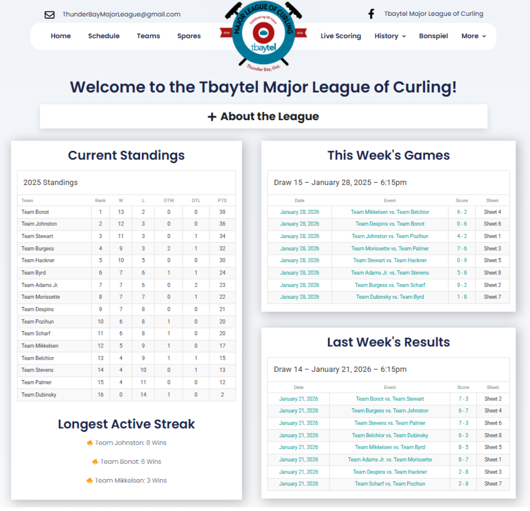
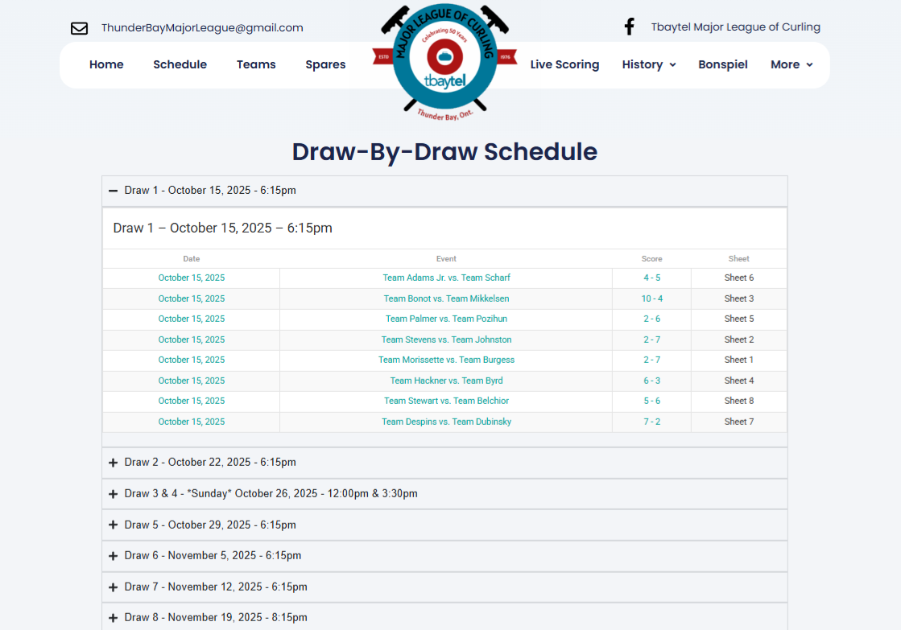
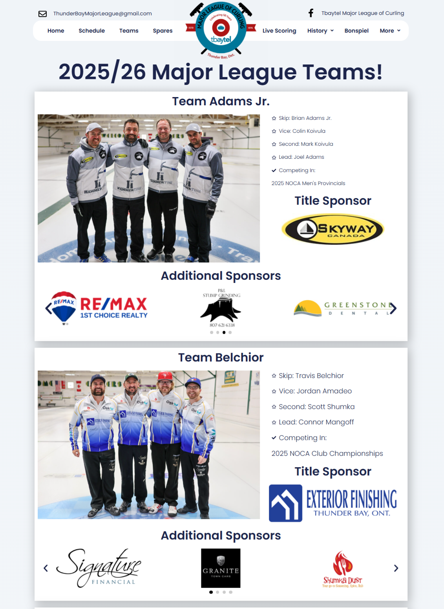
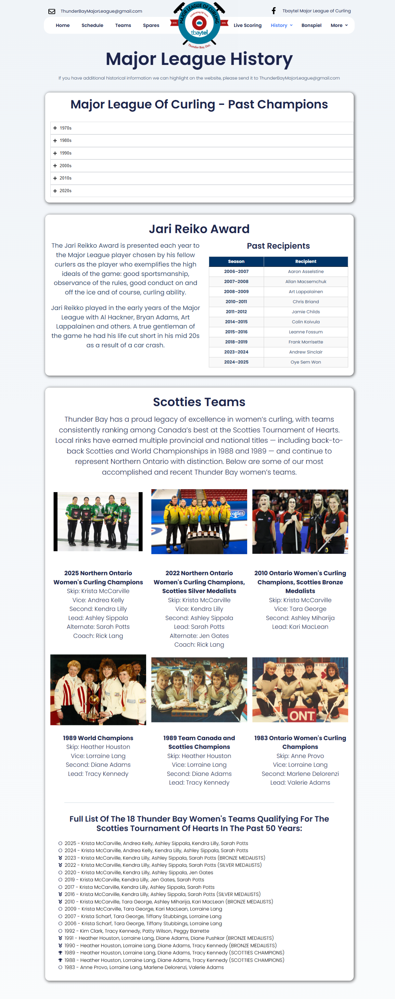
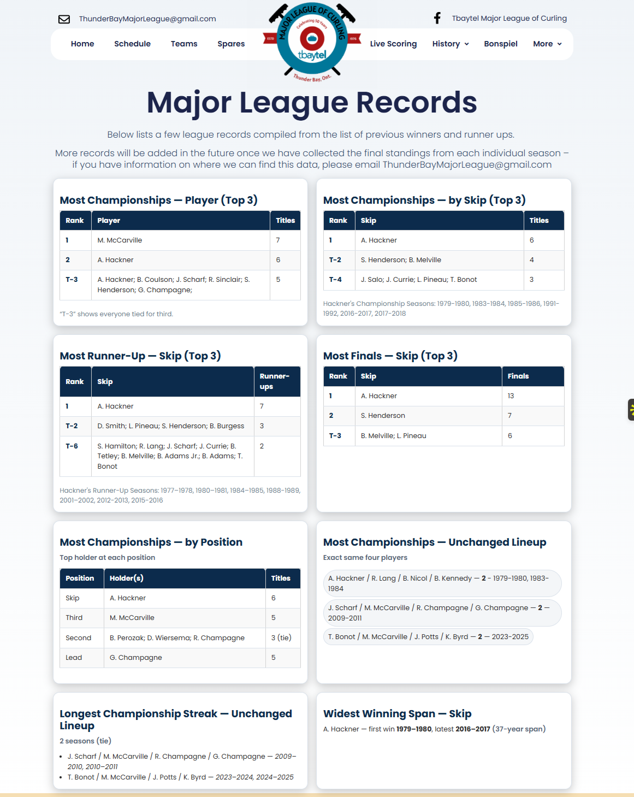
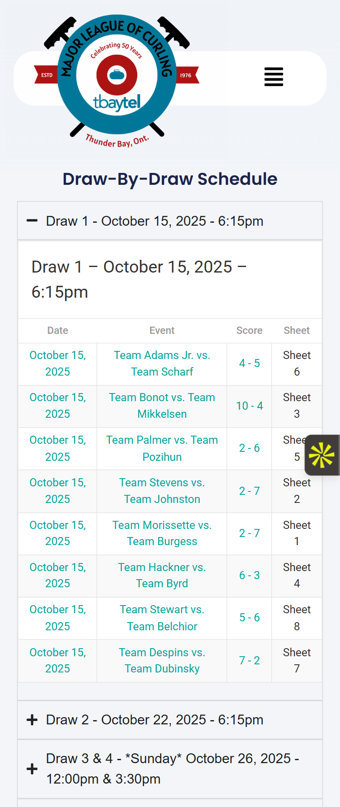
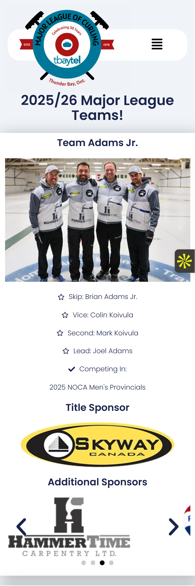
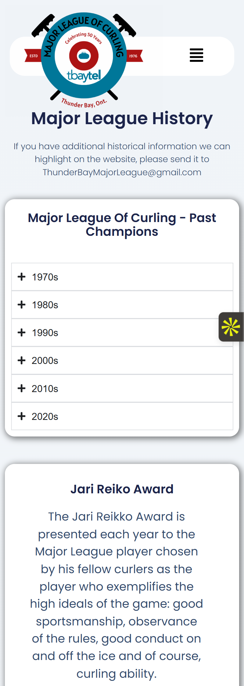
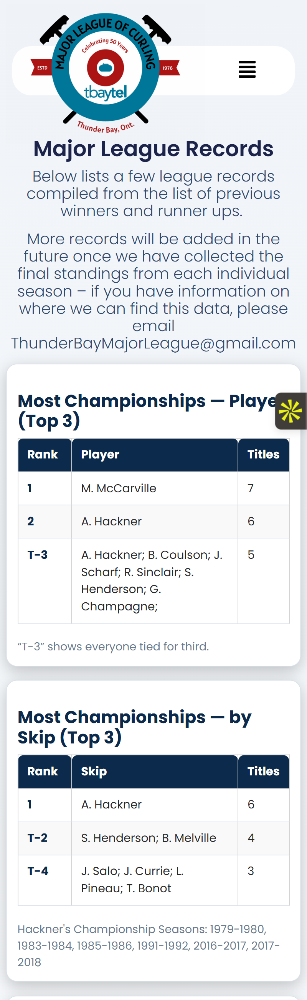

# Major League of Curling Website

Live Site: https://www.majorleaguecurling.com/



Portfolio case study of a live sports website built and maintained for a competitive curling league.  
The project demonstrates **product ownership, web delivery, and community engagement** using a fully **zero-cost technology stack**.

The website serves as the central hub for league operations including standings, schedules, team information, historical records, and live scoring.

---

## Project Overview

The **Major League of Curling** website was created to provide a centralized digital platform for players, fans, and sponsors.

The site organizes frequently updated league information into a clean and accessible interface while remaining **fast and responsive despite being built entirely with free tools**.

### Key Sections

- Home Page
- Schedule
- Teams
- Spares List
- Live Scoring
- League History
- League Bonspiel
- Records
- Rules & Regulations

The goal was to create a **professional sports league presence while keeping operating costs extremely low.**

---

## My Role

I managed the full digital presence of the league, including both the **website and social media engagement strategy**.

Responsibilities included:

- Designing and structuring the website
- Managing weekly content updates
- Organizing standings, schedules, and results
- Maintaining fast and responsive pages
- Promoting league activity through social media
- Creating weekly engagement content

This involved both **website product ownership** and **community engagement strategy.**

---

## Technology Stack

The site was intentionally built using **only free tools** to support league budgeting.

**Platform**

- WordPress

**Plugins**

- Elementor (Free Version)
- SportsPress (Free Version)

These tools were configured to support:

- Team pages
- Standings tables
- Game schedules
- Live scoring
- Historical records

Despite the free toolset, the website remains **fast, organized, and visually engaging.**

---

## Key Website Features

### League Information Hub

The website centralizes all league operations into a single accessible platform.

Core sections include:

- Weekly schedule and matchups
- Standings and results
- Team pages
- Spares availability
- Historical league records
- League rules and regulations
- Bonspiel event information

---

### Live Scoring

The **Live Scoring** page allows players and fans to follow games as they occur, improving engagement throughout each league night.

---

### Structured League History

Historical league data and records are organized into dedicated sections to preserve league achievements and milestones.

---

## Social Media Engagement Strategy

In addition to maintaining the website, I implemented a **weekly social media strategy** to increase engagement.

Weekly posts included:

- Featured **Team of the Week**
- Weekly matchup promotions
- Weekly results summaries
- League announcements

These posts were published on the league’s **Facebook page throughout the season.**

---

## Results (2025–2026 Season)

The coordinated website and social media strategy produced **significant engagement growth** compared to the previous season.

| Metric | 2024–2025 Season | 2025–2026 Season | Increase |
|------|------|------|------|
| Views | 10,000 | 190,700 | **+1821%** |
| Content Interactions | 117 | 3,100 | **+2550%** |
| Followers Gained | 18 | 96 | **+450%** |

These results demonstrate the impact of **consistent digital promotion combined with a centralized online platform.**

---

## System Design & Constraints

This project was intentionally built using a **zero-cost stack** to meet league budget constraints, while still delivering a reliable and engaging user experience.

### Key Considerations

- Using free plugins (**Elementor**, **SportsPress**) to replicate premium functionality  
- Structuring pages to support **frequent weekly updates**  
- Ensuring fast load times despite plugin limitations  
- Designing for both **desktop and mobile users**  
- Maintaining a clear navigation structure for non-technical users  

This required balancing **cost, usability, and maintainability**, similar to real-world product constraints.

---
## Screenshots

### Desktop Experience










---

### Mobile Experience






---

## Lessons Learned

Maintaining a live sports website highlighted several important design considerations:

- Sports information changes frequently and must be easy to update
- Navigation must be simple for casual visitors
- Mobile usability is critical for live sports content
- Consistent weekly content dramatically improves engagement

---

## Future Engineering Extensions

Potential technical improvements if the project were expanded further:

- Automated standings updates from game data
- Database-backed schedule and results tracking
- Player statistics dashboards
- Admin dashboard for score entry
- Sponsor engagement analytics
- Automated social media posting from game results

---

## Repository Purpose

This repository documents the structure, design decisions, and outcomes of the Major League of Curling website as a portfolio project demonstrating:

- Web product ownership
- Information architecture
- Community engagement strategy
- Responsive design considerations
- Real-world deployment and maintenance of a live website

---

## Repository Structure

```bash
assets/     # Screenshots of the website (desktop + mobile)
docs/       # Supporting documentation (architecture, decisions)
README.md   # Project overview and case study
